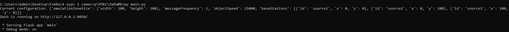
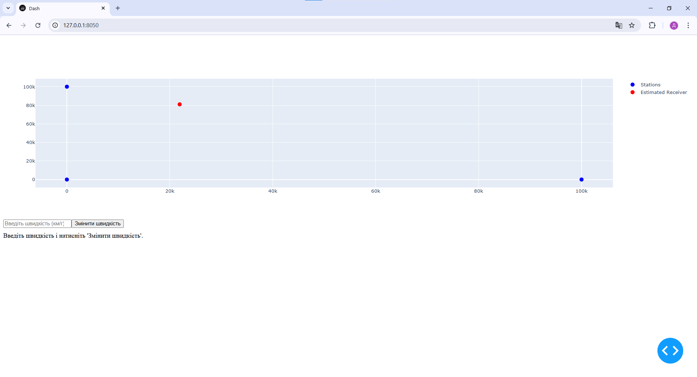
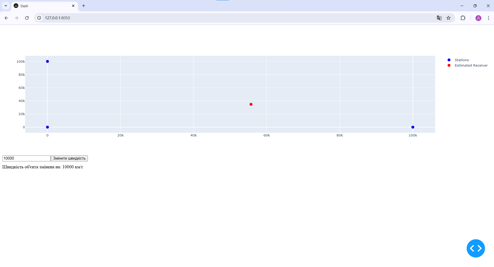

<h2>Візуалізація вимірювань LORAN</h2>

Цей застосунок призначений для візуалізації вимірювань від емульованої системи LORAN (Long Range Navigation). Він підключається до WebSocket-сервера, який надає дані про час надходження сигналів на базові станції, та обчислює положення об'єкта за допомогою методу мультилатерації.

<h3>Інструкція з виконання</h3>

<h4>1. Запуск емулятора LORAN</h4>

Виконуємо наступні команди для отримання та запуску Docker-контейнера:

<pre><code>docker pull iperekrestov/university:loran-emulation-service
docker run --name loran-emulator -p 4002:4000 iperekrestov/university:loran-emulation-service</code></pre>

<h4>2. Запуск застосунку</h4>

Після налаштування середовища запустимо сервер командою

<pre><code>python app.py</code></pre>

  

    Результат запуску сервера для подальшої праці з застосунком

  

    Результат зі швидкістю об'єкта 100 км/г (значення за замовчуванням)

  

    Результат зі швидкістю об'єкта 10000 км/г

<h3>Особливості</h3>
<ul>
  <li><strong>Візуалізація:</strong>
    <ul>
      <li>Відображення положення об'єкта та базових станцій на 2D-графіку.</li>
    </ul>
  </li>
  <li><strong>Обчислення положення об'єкта:</strong>
    <ul>
      <li>Використання методу різниці часу надходження сигналів (TDOA).</li>
      <li>Застосування чисельних алгоритмів оптимізації: Метод найменших квадратів та Градієнтний спуск.</li>
    </ul>
  </li>
  <li><strong>З'єднання в реальному часі:</strong>
    <ul>
      <li>Отримання даних через WebSocket-сервер.</li>
    </ul>
  </li>
  <li><strong>Налаштування параметрів:</strong>
    <ul>
      <li>Інтерфейс для зміни конфігурації системи, наприклад, швидкості об'єкта.</li>
    </ul>
  </li>
</ul>

<h3>Деталі реалізації</h3>
<ul>
  <li><strong>Python:</strong> Основна мова програмування для реалізації проєкту.</li>
  <li><strong>WebSocket:</strong> Протокол для отримання даних в реальному часі.</li>
  <li><strong>Методи оптимізації:</strong> Обчислення положення об'єкта за допомогою TDOA з використанням чисельних підходів.</li>
  <li><strong>Plotly:</strong> Бібліотека для інтерактивної побудови графіків.</li>
</ul>
